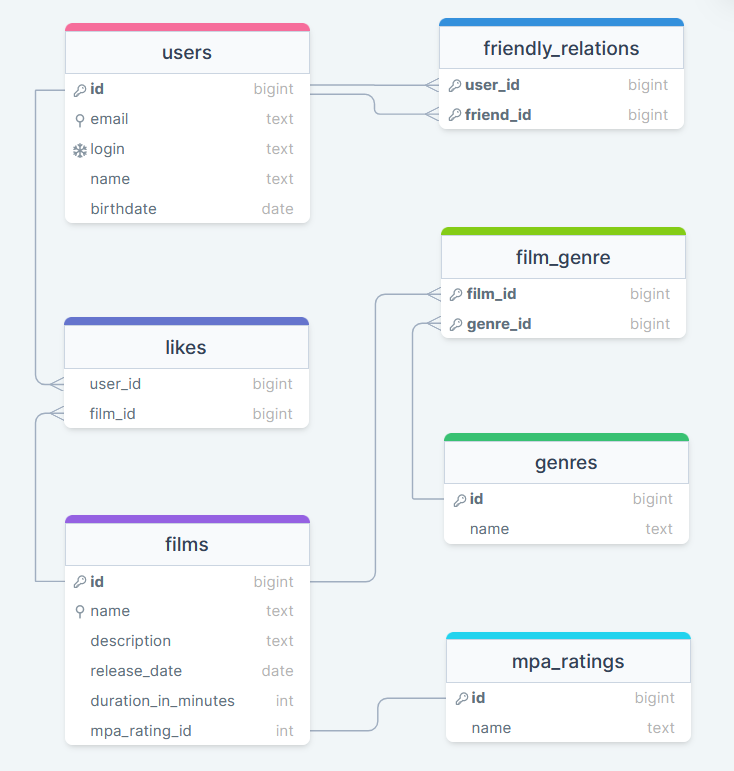

# java-filmorate

## Схема БД

<a href="https://drawsql.app/teams/olegs-team-7/diagrams/filmorate" title="перейти на сайт drawsql.app">
    
</a>

## Примеры запросов

<details>
    <summary><h3>Для пользователей:</h3></summary>
* Получение списка всех пользователей:

```SQL
SELECT *
FROM users;
```
* Получение информации по пользователю по его id:
```SQL
SELECT *
FROM users
WHERE users.user_id = ?;
```
</details>
<details>
    <summary><h3>Для фильмов:</h3></summary>
* Получение списка всех фильмов:

```SQL
SELECT *
FROM films;
```

* Получение информации по фильму по его id:
```SQL
SELECT *
FROM films
WHERE films.film_id = ?;
```
</details>